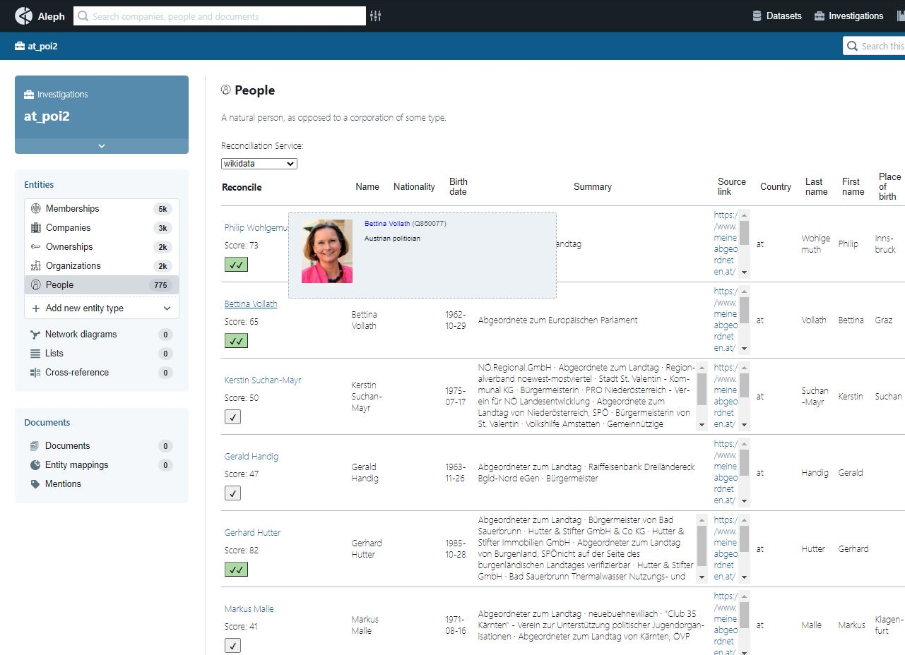

# Fork
This is a fork from [Aleph](https://github.com/alephdata/aleph). It extends the project with a reconciliation feature.



## How to run

Setup (taken from the [docs](https://docs.alephdata.org/developers/installation)):

1. Inside the Aleph root directory, use `make shell` to create a shell.
2. Paste those user credentials into the shell.
```
aleph createuser --name="Alice" \
                 --admin \
                 --password=123abc \
                 user@example.com
```
As this is just PoC, it as advised to run the project in development mode (regarding the CORS policy). It should run by only configuring the following, as I uploaded all config files

3. Leave shell 
4. Run:
	1. Use `make api` to run Aleph's API
	2. Use `make worker` to run a Worker
	3. Cd to `/ui` and run `npm install` and `npm start` (if an error occurs, update npm)
5. Login and use the service.

## Code
The code that has been additionally written can be primarily found at `aleph/ui/src/components/EntityReconciliationTable`.
